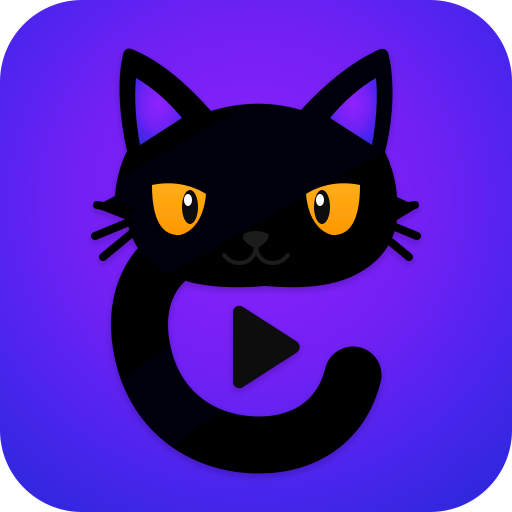

<h1 align="center">ReplayCat</h1>

<p align="center">
  
</p>

**Turn gameplay into highlights.**

ReplayCat is a simple, local gameplay video editor for Linux. Remove the boring parts, replay the best moment, zoom or freeze the action, add text, reaction clips, pictures, and sounds, and export a finished video without creating an account or uploading your footage.

ReplayCat deliberately focuses on the small set of tools that make gameplay videos fun and understandable instead of trying to be a full professional editor.

## Why ReplayCat exists

Gameplay edits should not require learning tracks, keyframes, or professional terminology. Cut points choose a moment; Cut removes it; Speed changes it; Zoom emphasizes it; Freeze holds it; Replay repeats it. The interface keeps the video large and puts advanced processing behind small, direct actions.

## Main features

- Remove unwanted moments with simple cut points.
- Replay a marked highlight in half-speed slow motion.
- Slow down or speed up a marked moment, focus zoom with one click, or hold an exact frame.
- Frame-step to the previous or next output frame.
- Add text with Pop, Fade, Bounce, and Shake presets.
- Add and directly position images, GIFs, reaction videos, and sounds.
- Fade overlay audio and automatically lower gameplay audio underneath it.
- Insert videos with fades, wipes, slides, zooms, blur, and other focused transitions.
- Create landscape videos or cropped 9:16 Shorts.
- Undo and redo normal editing actions.
- Export with Intel GPU acceleration when available and automatic CPU fallback.

## Private and local

ReplayCat requires no account and does not upload footage. Media inspection, preview proxies, editing, and export all happen locally on the computer. ReplayCat is open-source under GPL-3.0-only.

The active project is restored after the application closes. Choose **Project → Reset project** to forget it and start over. Exported videos remain ordinary files on disk.

## Requirements

- Ubuntu 26.04
- GNOME on Wayland
- A 64-bit Intel or AMD computer

Other Linux desktops, X11, Windows, and macOS are not currently supported.

### Intel hardware acceleration

ReplayCat includes a VAAPI-enabled FFmpeg. On Intel systems, install the media driver and give your user access to GPU render devices:

```bash
sudo apt install intel-media-va-driver-non-free vainfo
sudo usermod --append --groups render,video "$USER"
```

Log out and back in, then confirm that `id` lists `render` and `video` and that `vainfo --display drm --device /dev/dri/renderD128` succeeds. Render-node numbers may differ on multi-GPU systems. ReplayCat tries an Intel discrete GPU first, then an Intel iGPU, other VAAPI devices, and finally CPU encoding.

## Install and run

Download the AppImage from [Releases](https://github.com/mstasenko/replay-cat/releases), make it executable, and open it:

```bash
chmod +x replaycat-*.AppImage
./replaycat-*.AppImage
```

The first launch adds ReplayCat to the current user's application menu. It does not need `sudo`.

## Optional media pack

`replaycat-media-pack.zip` is a separate release download containing licensed reaction images, clips, and sounds. Extract it beside the AppImage:

```text
replaycat-*.AppImage
meme/
  image/
  video/
  audio/
```

ReplayCat works without the pack; use **New** to add your own media. The public pack is named **ReplayCat Open Media Pack**, and its manifest records the source, author, license, and conversion details for every file.

## Basic editing workflow

1. Drop a gameplay video into ReplayCat or choose **Open**.
2. Move the playhead and add cut points around an interesting or unwanted moment.
3. Click inside that marked moment, then Cut, change Speed, Zoom, Freeze, or Replay it.
4. Add text, an image, a reaction clip, or a sound from the side panel.
5. Choose **Export**.

Open and Export start in Videos. New media starts in Downloads. Each remembers its last folder until ReplayCat closes. Export blocks editing while it runs and can be cancelled safely.

## Keyboard shortcuts

| Key | Action |
| --- | --- |
| Space | Play or pause |
| Left / Right | Move five seconds |
| Shift+Left / Shift+Right | Previous / next frame |
| Mouse wheel over timeline | Zoom |
| Delete | Remove the selected item or highlighted range |
| Ctrl+Z | Undo |
| Ctrl+Shift+Z | Redo |

## Development

Install Node.js 22.22 or newer and npm 11.18, then run:

```bash
npm ci
npm run dev
```

Build the AppImage and public media pack with:

```bash
npm run package
```

Outputs are written to `release/`. Run the complete local gate with `npm test`; run `npm run verify:ci` to repeat the clean dependency install, audit, and software-rendered CI path.

The cat is ReplayCat's mascot and a small nod to Unix concatenation; FFmpeg performs the actual media processing.

## FFmpeg and third-party components

ReplayCat uses FFmpeg locally for media inspection, playback proxies, and video export. FFmpeg and the included media and fonts retain their respective licenses.

## License

ReplayCat source code is licensed under GPL-3.0-only. Optional media-pack items and bundled fonts retain their respective licenses; see their manifests and license files for details.
